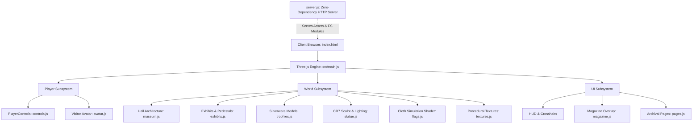

# Real Madrid Museum — Hall of Legends

An interactive 3D WebGL / Three.js museum celebrating the history, trophies, architecture, and legends of **Real Madrid Club de Fútbol** (Est. 1902).

Walk the grand marble halls in first-person or third-person ("Eagle Eye") view, inspect meticulously modeled silverware, view real-time waving club banners, experience an interactive time-traveling Santiago Bernabéu painting, and explore the Cristiano Ronaldo monument and Ballon d'Or gallery.

---

## Table of Contents

- [Overview](#overview)
- [Key Exhibits & Features](#key-exhibits--features)
  - [1. Kings of Europe — UCL Trophy Wall](#1-kings-of-europe--ucl-trophy-wall)
  - [2. Cristiano Ronaldo Monument & Ballon d'Or Gallery](#2-cristiano-ronaldo-monument--ballon-dor-gallery)
  - [3. Domestic Honours Showcase](#3-domestic-honours-showcase)
  - [4. Santiago Bernabéu: Past & Present](#4-santiago-bernabéu-past--present)
  - [5. Dynamic Cloth Simulation Banners](#5-dynamic-cloth-simulation-banners)
  - [6. Dual Camera Modes & Animated Avatar](#6-dual-camera-modes--animated-avatar)
  - [7. Interactive Digital Magazine Reader](#7-interactive-digital-magazine-reader)
- [Controls & Navigation](#controls--navigation)
- [Architecture & Technical Highlights](#architecture--technical-highlights)
  - [3D Rendering & Lighting Pipeline](#3d-rendering--lighting-pipeline)
  - [Procedural Texture Synthesis](#procedural-texture-synthesis)
  - [Custom Vertex Shader Cloth Simulation](#custom-vertex-shader-cloth-simulation)
  - [3D Model Assembly & Stone Shaders](#3d-model-assembly--stone-shaders)
  - [Bounding-Box Collision System](#bounding-box-collision-system)
  - [Fail-Safe Input Handling & Boot Guard](#fail-safe-input-handling--boot-guard)
- [Directory Structure](#directory-structure)
- [Getting Started](#getting-started)
  - [Prerequisites](#prerequisites)
  - [Installation & Launch](#installation--launch)
  - [Important Note on the `file://` Protocol](#important-note-on-the-file-protocol)
- [Testing & Quality Assurance](#testing--quality-assurance)
- [Asset Pipeline & Credits](#asset-pipeline--credits)
- [License](#license)

---

## Overview

The **Real Madrid Museum: Hall of Legends** is an in-browser 3D architectural gallery modeled to capture the grandeur of the Santiago Bernabéu trophy halls. Built without heavy build-step tooling, it runs directly in modern browsers via native ES modules and Three.js.

The project combines real-time computer graphics, procedural texture generation, physical collision detection, and curated historical football archives spanning 1902 through 2024.

---

## Key Exhibits & Features

### 1. Kings of Europe — UCL Trophy Wall
- **15 European Cups / UEFA Champions Leagues**: Real Madrid's complete continental dominance arranged across a dual-tier mahogany and gold-trimmed display.
- **Year Chips**: Every individual cup features a high-resolution brass and gold plaque indicating the exact final year (1956 to 2024).
- **La Decimoquinta Centerpiece**: A grand 1.35m centerpiece model of the 2024 Wembley trophy resting on a dark marble and hardwood pedestal with dedicated spotlights.
- **Interactive Exhibit**: Press **`E`** or click the exhibit to open the comprehensive 15-chapter European Cup history magazine detailing scores, opponents, venues, and match summaries.

### 2. Cristiano Ronaldo Monument & Ballon d'Or Gallery
- **The Monument**: A life-sized weathered-stone sculpture capturing Cristiano Ronaldo's iconic "Siuu" landing stance in the east wing.
- **Composite 3D Sculpting**: Assembled dynamically from a re-posed Mixamo rigged skeletal humanoid (`Xbot.glb`) and a high-resolution photogrammetric human head scan (`LeePerrySmith.glb`) reproportioned to Ronaldo's facial features and swept quiff.
- **Dynamic Accent Lighting**: Overhead rotating spotlights illuminate the monument in real time.
- **Ballon d'Or Gallery**: Press **`E`** to open the interactive Ballon d'Or digital archive featuring all Madrid winners: Alfredo Di Stéfano, Raymond Kopa, Luís Figo, Ronaldo Nazário, Fabio Cannavaro, Cristiano Ronaldo, Luka Modrić, and Karim Benzema.

### 3. Domestic Honours Showcase
- **Custom-Modeled Trophies**: Procedurally constructed 3D models based on the authentic silhouettes of Spanish football silverware:
  - **La Liga** (Record 36 titles)
  - **Copa del Rey** (20 titles)
  - **Supercopa de España** (13 titles)
- **Interactive Album**: Press **`E`** at the exhibit to view detailed chronological breakdowns of every domestic title.

### 4. Santiago Bernabéu: Past & Present
- **Time-Travel Oil Painting**: Located in the west wing, showcasing the evolution of Real Madrid's temple.
- **Proximity Interactive Transition**: Approach the painting and press **`E`** or click to morph the artwork between the historic stadium (1947–2000s) and the modernized 2024 Santiago Bernabéu.
- **Lighting Feedback**: The gold picture light above the frame dynamically flares and pulses during the transition.

### 5. Dynamic Cloth Simulation Banners
- **Real-Time Cloth Physics**: Banners suspended from the gallery ceiling wave continuously using a custom GLSL vertex shader.
- **Analytical Normals**: Vertex normals are recalculated analytically within the shader based on partial derivatives of the wave equation, allowing the fabric folds to accurately interact with scene lighting, specular highlights, and shadows.
- **High-Res Club Insignia**: Detailed vector-drawn crests and typographic motifs with anisotropic texture filtering.

### 6. Dual Camera Modes & Animated Avatar
- **First-Person View (FPV)**: Immersive eye-level gallery walkthrough at 1.75m eye height with head bobbing and smooth inertial damping.
- **Eagle Eye Mode (Third-Person)**: Press **`V`** or click the top-right button to smoothly blend the camera up and back into an orbital perspective.
- **Visitor Avatar**: In Eagle Eye mode, your visitor avatar appears dressed in the Real Madrid white home kit with synchronized walking leg and arm swing animations.

### 7. Interactive Digital Magazine Reader
- **Overlay Interface**: Fully responsive magazine interface presenting archival photographs and historical summaries.
- **Navigation**: Flip pages using **`←` / `→`** arrow keys or on-screen chevron buttons; exit anytime with **`E`**, **`Esc`**, or by clicking outside the magazine shell.

---

## Controls & Navigation

| Control | Action | Details |
|---|---|---|
| **`W` `A` `S` `D`** / **Arrows** | **Walk** | Smooth directional movement with collision response |
| **Mouse** | **Look** | First-person look when pointer lock is active |
| **Click + Drag** | **Look (Fallback)** | Smooth drag-to-look anytime pointer lock is released or unsupported |
| **`E`** or **Left Click** | **Interact** | Opens whichever exhibit or display you are currently facing |
| **`V`** or **Top-Right Button** | **Switch View** | Toggle between First-Person View and Third-Person Eagle Eye |
| **Mouse Wheel** | **Camera Zoom** | Adjusts camera distance and height in Eagle Eye view |
| **`←` `→` Keys** | **Turn Pages** | Navigate pages in open magazine exhibits |
| **`Esc`** | **Release Cursor** | Exits pointer lock without freezing controls |

> **Fail-Safe Control Guarantee:** Looking and walking never depend strictly on browser pointer lock. If your browser restricts pointer lock or you press `Esc`, drag-to-look takes over immediately and keyboard locomotion continues seamlessly.

---

## Architecture & Technical Highlights



### 3D Rendering & Lighting Pipeline
- **Tone Mapping**: ACESFilmic tone mapping (`exposure = 1.12`) ensures metallic highlights on gold and silver trophies don't blow out while preserving shadow detail.
- **Shadow Mapping**: PCF Soft Shadow Maps (`PCFSoftShadowMap`) provide realistic contact shadows beneath pedestals, columns, and visitor feet.
- **Custom Material Lighting**: Hand-written gallery, metal, cloth, painting, and stone shaders provide diffuse/specular shading and metallic Fresnel highlights. The statue shader receives two animated spotlight uniforms.
- **Layered Illumination**:
  - Cool gallery wash: Hemisphere light (`0xf2f6ff` / `0x2b2d33`) and ambient light (`0.18`).
  - Ceiling grid spotlights: 8 cool-white LED spotlights wash the floor runners.
  - Exhibit spotlights: Dedicated warm gold spotlights (`#ffe9c4`, `#fff0d4`) highlight trophies and pedestals.

### Procedural Texture Synthesis
To keep download sizes minimal while ensuring razor-sharp visuals, textures are generated dynamically via HTML5 Canvas in `src/world/textures.js`:
- **Carrara Marble Floor**: Multi-octave Perlin-style noise veining, specular reflection tuning, and tile grout simulation.
- **Museum Walls & Ceilings**: Granular plaster bump maps and acoustic ceiling tile patterns.
- **Cabinetry & Trim**: Mahogany and dark walnut wood grain textures.
- **Brass & Gold Plaques**: Brushed metal gradients with engraved typography borders.

### Custom Vertex Shader Cloth Simulation
The club banners use an explicit `AnimatedClothShader` in `src/world/shaders.js`:
$$\Delta z = A_1 \sin(k_1 x + \omega_1 t) + A_2 \cos(k_2 x + \omega_2 t)$$
Normals are calculated directly on the GPU from the partial derivatives:
$$N = \text{normalize}\left(-\frac{\partial z}{\partial x}, -\frac{\partial z}{\partial y}, 1\right)$$
This ensures dynamic light reflections curve naturally across folds without CPU overhead.

### 3D Model Assembly & Stone Shaders
In `src/world/statue.js`, the Cristiano Ronaldo monument combines:
1. Mixamo humanoid rig (`Xbot.glb`) with joint rotations positioned into the "Siuu" stance.
2. 3D scanned portrait geometry (`LeePerrySmith.glb`), modified at the neck junction, scaled to Ronaldo's jawline, and merged with hand-modeled quiff hair.
3. A custom weathered-stone shader with granular surface variation, marble stain veins, and moving spotlight highlights.

### Bounding-Box Collision System
Colliders are derived directly from the physical geometry of scene objects via `THREE.Box3().setFromObject()`. Any element marked `solid: true` automatically registers in the collision tree, ensuring visitors cannot walk through walls, columns, pedestals, or trophy cases.

### Fail-Safe Input Handling & Boot Guard
- **Boot Guard (`index.html`)**: A lightweight script detects if the project is opened improperly (e.g. double-clicked over `file://`) and renders a clear diagnostics panel rather than a broken blank screen.
- **Decoupled Step Loop (`window.__museum.step`)**: Physics and game logic updates are decoupled from rendering frames, allowing automated headless test suites to advance world state deterministically.

---

## Directory Structure

```
Real-Madrid-Museum/
├── .gitignore               # Git exclusions (node_modules, logs, virtual environments)
├── README.md                # Comprehensive project documentation
├── index.html               # Main HTML entry point, import map, HUD & boot guard
├── package.json             # Project metadata, scripts, and dependencies
├── server.js                # Zero-dependency local Node.js static server
├── styles.css               # Museum HUD, splash screen, and magazine styling
│
├── assets/
│   ├── manifest.json        # Mapping of historical photos to Wikimedia Commons sources
│   ├── img/                 # High-resolution Wikimedia Commons archival images
│   └── models/
│       ├── CREDITS.md       # Attribution for 3D model sources
│       ├── LeePerrySmith.glb# Photo-scanned head model (CC-BY 3.0)
│       └── Xbot.glb         # Mixamo rigged humanoid model
│
├── src/
│   ├── main.js              # Application bootstrapper, render loop & event dispatching
│   ├── data/
│   │   └── history.js       # Curated database of UCL finals, Ballon d'Or, and domestic trophies
│   ├── player/
│   │   ├── avatar.js        # 3D visitor character model in Real Madrid home kit
│   │   └── controls.js      # Dual FPV/Eagle-Eye camera controller & input smoothing
│   ├── ui/
│   │   ├── magazine.js      # Digital magazine overlay modal controller
│   │   └── pages.js         # Page builder for UCL, Ballon d'Or, and domestic honors
│   └── world/
│       ├── exhibits.js      # Trophy wall, domestic pedestals, and Bernabéu painting
│       ├── flags.js         # Animated cloth shader banners with club crest
│       ├── museum.js        # Hall architecture (walls, floor, ceiling, columns, lighting)
│       ├── shaders.js       # Custom gallery, metal, cloth, painting, and stone shaders
│       ├── statue.js        # CR7 monument assembly, skeletal pose, and stone shaders
│       ├── textures.js      # Procedural canvas texture generation engine
│       └── trophies.js      # Accurate procedural 3D models for all four trophies
│
└── tools/
    ├── check_shots.py       # Validates generated screenshots against visual baselines
    ├── collisiontest.js     # 2,500-route collision suite ensuring no clipping
    ├── download_assets.py   # Automated Wikimedia Commons photo downloader
    ├── face_crop.py         # Haar cascade portrait cropping utility
    ├── selftest.js          # Headless Playwright automated interaction test
    ├── shots.js             # Automated screenshot capture suite
    ├── smoke_test.js        # Fast smoke validation test
    └── shots/               # Verified gallery screenshots and visual records
```

---

## Getting Started

### Prerequisites

- [Node.js](https://nodejs.org/) (version 18.0 or higher recommended)
- A modern web browser supporting WebGL (Chrome, Edge, Firefox, Brave, Safari)

### Installation & Launch

1. **Install dependencies**:
   ```bash
   npm install
   ```
   *Installs Three.js (and Playwright if running automated tests).*

2. **Start the local server**:
   ```bash
   npm start
   ```

3. **Visit the museum**:
   Open **`http://localhost:5173`** in your browser.

4. Click **CLICK TO ENTER** on the splash screen to enter the gallery.

### Important Note on the `file://` Protocol

> **Do not open `index.html` by double-clicking it from your file explorer.**
>
> Modern web browsers enforce CORS (Cross-Origin Resource Sharing) security restrictions that prevent loading JavaScript ES modules, GLTF/GLB 3D models, and textures directly over the `file://` protocol. Running through `npm start` serves the files with the appropriate MIME types (`model/gltf-binary`, `text/javascript`, etc.) via `server.js`.

---

## Testing & Quality Assurance

The museum includes an automated headless testing suite powered by Playwright to ensure physics, controls, and rendering remain bug-free:

```bash
# 1. Start the server in one terminal:
npm start

# 2. In a second terminal, execute test suites:

# Verify entry, movement, drag-look fallback, view switching, and magazine reader
node tools/selftest.js

# Stress-test 2,500 routes to ensure no solid props can be walked through
node tools/collisiontest.js

# Regenerate gallery screenshots into tools/shots/
node tools/shots.js
```

All test scripts interface with `window.__museum.step()`, advancing simulation time deterministically without relying on browser compositor frame rates.

---

## Asset Pipeline & Credits

- **Photographic Assets**: Historical photographs are freely-licensed images retrieved from **Wikimedia Commons**. Source links and licensing details for each image are tracked in [`assets/manifest.json`](file:///c:/Users/borsh/Desktop/Project-updated%20%285%29/Project/assets/manifest.json). Re-download anytime via:
  ```bash
  python tools/download_assets.py
  ```
- **3D Head Scan**: `LeePerrySmith.glb` originated from Infinite Realities / Lee Perry-Smith (licensed under **CC-BY 3.0** via Three.js example assets).
- **Humanoid Rig**: `Xbot.glb` provided by Mixamo / Adobe (Three.js sample model).
- See [`assets/models/CREDITS.md`](file:///c:/Users/borsh/Desktop/Project-updated%20%285%29/Project/assets/models/CREDITS.md) for full licensing details.

---

## License

This project is licensed under the [MIT License](file:///c:/Users/borsh/Desktop/Project-updated%20%285%29/Project/package.json).
